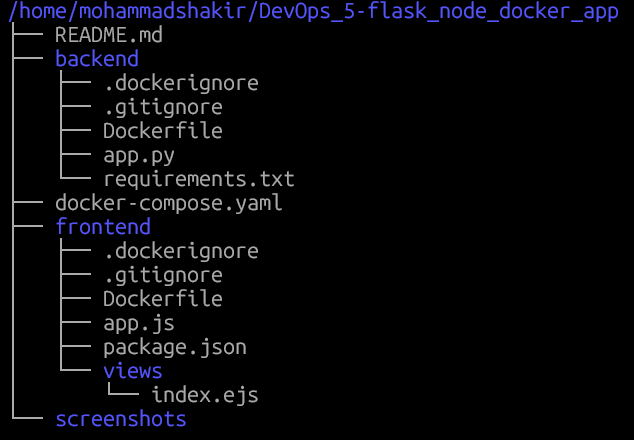
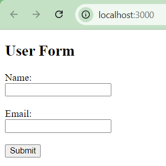
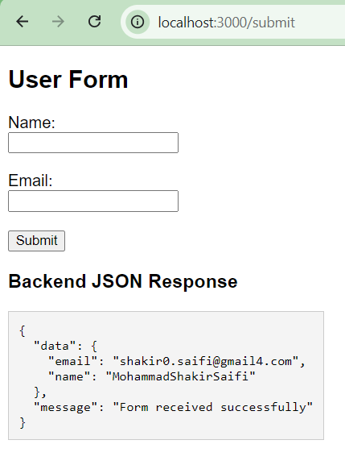
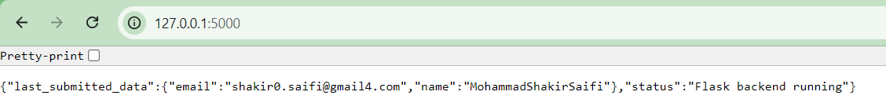
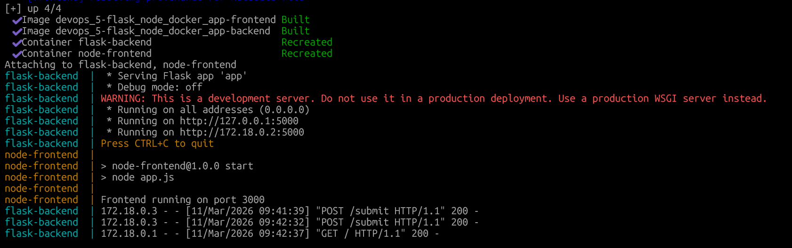
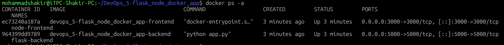

# Flask + Node.js Dockerized Application

## 📌 Project Overview
This project demonstrates integration between a **Node.js (Express) frontend** and a **Flask backend**, containerized using **Docker** and orchestrated with **Docker Compose**.

The frontend contains a user form that sends data to the Flask backend, which processes and returns a response.

---

## 🛠️ Tech Stack
- Frontend: Node.js, Express, EJS
- Backend: Python, Flask
- Containerization: Docker
- Orchestration: Docker Compose
- Version Control: GitHub

---

## 📁 Project Structure
```bash
/home/mohammadshakir/DevOps_5-flask_node_docker_app
├── README.md
├── backend
│   ├── Dockerfile
│   ├── app.py
│   └── requirements.txt
├── docker-compose.yaml
└── frontend
    ├── Dockerfile
    ├── app.js
    ├── package.json
    └── views
        └── index.ejs
```

---

## ⚙️ Application Workflow
1. User opens frontend at `http://localhost:3000`
2. Form data is submitted
3. Node.js frontend sends data to Flask backend
4. Flask backend processes data and returns JSON response
5. Response is displayed to the user

---

## 🐳 Docker Configuration

### Frontend
- Runs on port **3000**
- Built using Node.js Alpine image

### Backend
- Runs on port **5000**
- Built using Python Slim image

### Docker Compose
- Both services run on the same Docker network
- Service-to-service communication via container names

---

## ▶️ How to Run the Application

### Prerequisites
- Docker
- Docker Compose

### Steps
```bash
git clone <your-github-repo-url>
cd flask-node-docker-app
docker compose up --build
```
🌐 Access URLs

Frontend: http://localhost:3000

Backend API: http://localhost:5000/submit

📦 Docker Hub Images

Frontend Image: yourdockerhub/node-frontend

Backend Image: yourdockerhub/flask-backend

---

#### 📸Screenshots Section

## Screenshots

**1. Project Folder Structure**



**2. Frontend User Interface**



**3. Form Submission**



**4. Backend JSON Response**



**5. Docker Compose Running**



**6. Running Containers**




Docker Hub Images:
- https://hub.docker.com/r/shakirp/flask-backend
- https://hub.docker.com/r/shakirp/node-frontend
